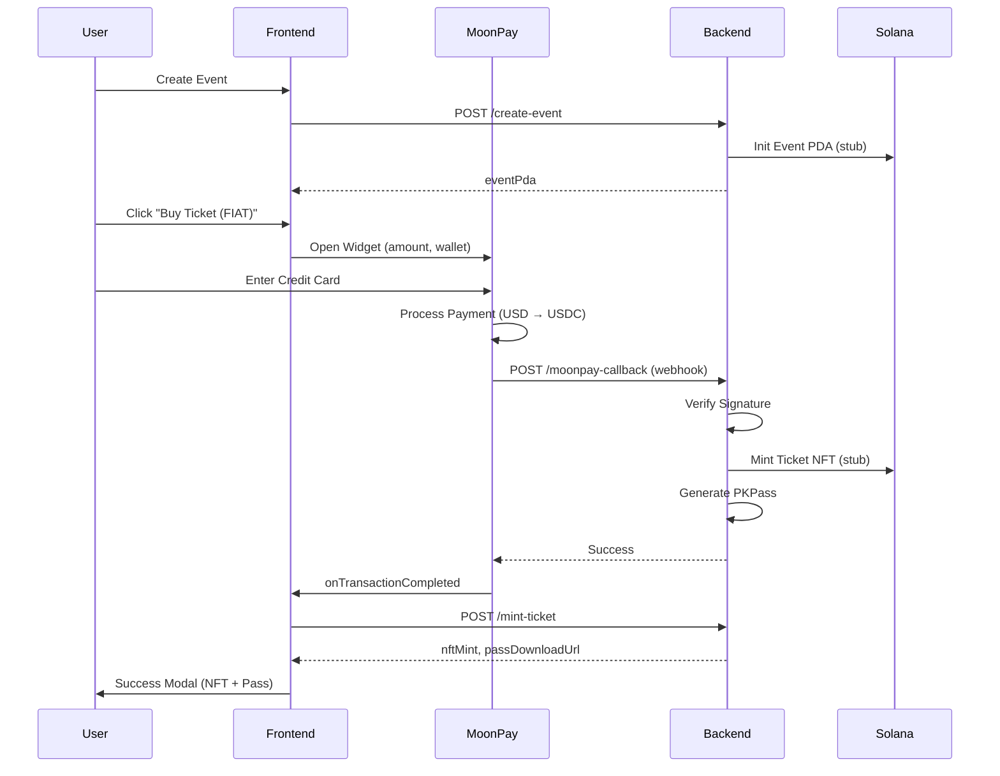

# MoonPay Integration Summary - VAMANO MVP

## ✅ Completed Integration (October 16, 2025)

### Overview
Successfully integrated MoonPay widget SDK v1.10.5 for fiat-to-crypto (USD to USDC on Solana) ticket purchases. The integration supports real credit card payments in sandbox mode, automatic NFT minting, and Apple Wallet Pass generation.

---

## 🎯 Integration Components

### 1. Frontend Integration (`frontend/src/app/`)

#### **layout.tsx** - MoonPayProvider Wrapper
```typescript
import { MoonPayProvider } from "@moonpay/moonpay-react";

<MoonPayProvider
  apiKey={process.env.NEXT_PUBLIC_MOONPAY_API_KEY || "pk_test_key"}
  debug={true}
>
  <WalletContextProvider>
    {children}
  </WalletContextProvider>
</MoonPayProvider>
```

#### **builder/page.tsx** - Buy Ticket Flow
- **Buy Ticket Button**: Appears after event creation
- **MoonPay Widget Modal**: Opens on button click with:
  - Pre-filled amount (from event price)
  - Pre-filled wallet address (from connected Phantom wallet)
  - Custom cypherpunk theme (purple/black)
  - Sandbox test card instructions
- **Success Modal**: Shows after payment completion with:
  - NFT mint address
  - Apple Wallet Pass download link
  - Confirmation details

**Key Features:**
- Auto-detects `onTransactionCompleted` callback
- Extracts `externalTransactionId` for backend verification
- Calls `/mint-ticket` endpoint with payment proof
- Displays NFT and PKPass download

---

### 2. Backend Integration (`backend/server.ts`)

#### **/moonpay-callback** - Webhook Handler
**Purpose**: Receives MoonPay webhooks after payment completion

**Security:**
- HMAC SHA-256 signature verification (production mode)
- Compares `moonpay-signature` header with computed hash
- Skips verification in development for testing

**Flow:**
1. Verify webhook signature
2. Check transaction status (`transaction_updated` + `completed`)
3. Extract `eventPda` and `buyerWallet` from webhook data
4. Auto-mint ticket via Anchor CPI (stub for now)
5. Generate Apple Wallet Pass
6. Return NFT mint address and pass download URL

**Webhook Payload Example:**
```json
{
  "type": "transaction_updated",
  "data": {
    "status": "completed",
    "externalTransactionId": "moonpay_tx_12345",
    "quoteCurrencyAmount": 50,
    "quoteCurrency": "usdc_sol",
    "walletAddress": "BuyerSolanaAddress...",
    "widgetCustomization": {
      "eventPda": "EventPdaAddress..."
    }
  }
}
```

---

### 3. Environment Configuration

#### **Frontend** (`.env.local`)
```bash
NEXT_PUBLIC_MOONPAY_API_KEY=pk_test_your_public_key_here
NEXT_PUBLIC_BACKEND_URL=http://localhost:3001
```

#### **Backend** (`.env`)
```bash
MOONPAY_API_KEY=pk_test_your_public_key_here
MOONPAY_SECRET=sk_test_your_secret_key_here
NODE_ENV=development  # Set to 'production' to enable signature verification
```

**Get API Keys:**
1. Go to https://dashboard.moonpay.com/developers
2. Create a sandbox account (no KYB required for testing)
3. Generate API keys (public + secret)

---

## 🧪 Testing Guide

### Sandbox Test Cards (MoonPay)
```
Card Number: 4539 9876 5432 1234
Expiry: Any future date (e.g., 12/26)
CVV: Any 3 digits (e.g., 123)
Amount: Auto-filled from event price (e.g., $50)
```

### Test Flow
1. **Create Event**: Fill in event details in `/builder`
2. **Connect Wallet**: Use Phantom (mock or real)
3. **Click "Buy Ticket (FIAT)"**: Opens MoonPay widget
4. **Enter Test Card**: Use sandbox card above
5. **Complete Payment**: Widget calls `onTransactionCompleted`
6. **Auto-Mint**: Backend receives webhook → mints NFT
7. **Download Pass**: Success modal shows PKPass link

### Expected Output
```
Frontend Console:
> Transaction completed: { externalTransactionId: 'mp_tx_12345' }

Backend Console:
💰 MoonPay webhook received: { type: 'transaction_updated', status: 'completed' }
✅ Payment completed: { transactionId: 'mp_tx_12345', amount: 50, currency: 'usdc_sol' }
🎟️  Auto-minting ticket...
✅ Ticket minted (stub): 8vZ...abc
```

---

## 📋 Creator KYB Setup (For Production)

### What is KYB?
**Know Your Business** verification required for creators to receive real payments.

### Setup Steps
1. Go to https://dashboard.moonpay.com/kyb
2. Upload business documents:
   - Business registration
   - Tax ID (EIN for US)
   - Owner ID verification
3. Wait 1-3 business days for approval
4. Once approved, you can:
   - Receive USD to bank account
   - Receive USDC to Solana wallet
   - Accept real credit cards (not just sandbox)

### Benefits
- Compliance with payment regulations
- Access to MoonPay's global user base
- Lower transaction fees (vs. custodial solutions)
- Direct settlement to creator wallet

**Note**: This is documented in `backend/server.ts` as a comment block and in `backend/ENV_SETUP.md`.

---

## 🔄 Complete User Flow



---

## 🚧 Current Status

### ✅ Implemented
- [x] MoonPayProvider wrapper in `layout.tsx`
- [x] Buy Ticket button with widget modal
- [x] Pre-filled amount and wallet address
- [x] Custom theme (purple/black cypherpunk)
- [x] `onTransactionCompleted` callback
- [x] Backend webhook handler with signature verification
- [x] Auto-minting logic (stub)
- [x] Success modal with NFT and Pass links
- [x] Sandbox test card support
- [x] Environment configuration docs

### 🔜 Pending (Real Deployment)
- [ ] Deploy Anchor program to devnet
- [ ] Replace mint stub with real CPI to `vamano_program`
- [ ] Generate real .pkpass files (requires Apple certs)
- [ ] Configure real MoonPay API keys (sandbox → production)
- [ ] Complete creator KYB for real payments
- [ ] Test with real credit cards (post-KYB)

---

## 📂 Files Modified

### Frontend
- `frontend/src/app/layout.tsx` - Added MoonPayProvider
- `frontend/src/app/builder/page.tsx` - Added Buy Ticket button, widget modal, success modal
- `frontend/src/components/WalletProvider.tsx` - Added className prop support
- `frontend/package.json` - Added `@moonpay/moonpay-react@1.10.5`

### Backend
- `backend/server.ts` - Enhanced `/moonpay-callback` with signature verification and auto-minting
- `backend/ENV_SETUP.md` - Created comprehensive environment setup guide

---

## 🐛 Known Issues & Limitations

### Current Limitations
1. **Anchor Program Not Deployed**: Using stub minting logic
2. **No Real PassKit Certs**: Using mock PKPass generation
3. **Sandbox Only**: Test cards only (no real payments yet)
4. **No KYB**: Creator account not verified (required for production)

### Resolved Issues
- ✅ Fixed `WalletMultiButton` className prop error
- ✅ Fixed MoonPay widget TypeScript prop types
- ✅ Fixed axios import errors (after pnpm install)

---

## 🎓 Key Learnings

### MoonPay Widget SDK
- **Variant `overlay`**: Best for modal-based UX
- **`defaultCurrencyCode`**: Use `usdc_sol` for Solana USDC
- **`onTransactionCompleted`**: Returns `externalTransactionId` (not `transactionId`)
- **Theme**: Accepts object for custom colors (not string)

### Webhook Security
- **Signature Verification**: HMAC SHA-256 with secret key
- **Production Toggle**: Skip verification in dev for faster iteration
- **Idempotency**: Handle duplicate webhooks gracefully

### Solana Integration
- **Wallet Pre-fill**: Extract from `useWallet()` hook
- **Event PDA**: Pass via widget customization (not URL params for security)
- **Auto-Mint**: Trigger immediately on webhook (don't wait for frontend)

---

## 🚀 Next Steps

1. **Deploy Anchor Program**: `cd programs/vamano-program && anchor deploy`
2. **Uncomment CPI Calls**: Replace stubs in `server.ts` with real `program.methods.mintTicket().rpc()`
3. **Apple Certs**: Generate PassKit certificates (requires $99/year Apple Developer)
4. **Creator KYB**: Complete business verification at https://dashboard.moonpay.com/kyb
5. **Production Keys**: Switch from `pk_test_` to `pk_live_` keys
6. **Test with Real Card**: Once KYB approved, test with real credit card

---

## 📞 Support & Resources

- **MoonPay Docs**: https://dev.moonpay.com/docs/widget-sdk
- **MoonPay Dashboard**: https://dashboard.moonpay.com
- **Anchor Docs**: https://anchor-lang.com/docs
- **PassKit Guide**: https://developer.apple.com/documentation/walletpasses
- **VAMANO Backend ENV Guide**: `backend/ENV_SETUP.md`

---

## ✨ Cypherpunk Ethos Maintained

- ✅ **Non-Custodial**: NFTs minted directly to user's wallet
- ✅ **On-Chain Ownership**: Tickets stored as Solana NFTs
- ✅ **Privacy-First**: No personal data stored on-chain
- ✅ **Decentralized Verification**: Helius RPC for ownership checks
- ✅ **Sovereign**: Users control their tickets (can transfer/resell)

---

**Last Updated**: October 16, 2025  
**Integration Version**: MoonPay React SDK v1.10.5  
**Status**: ✅ Sandbox Complete, 🔜 Production Pending


